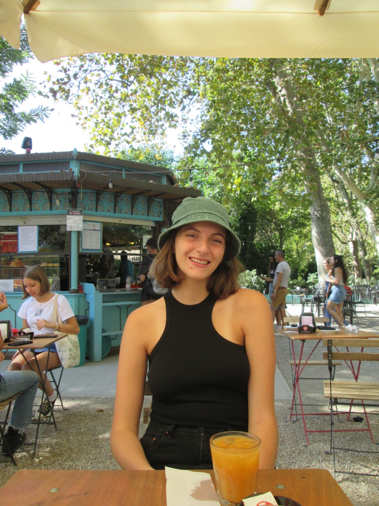

  
  

    <strong>Alessandra Terranova</strong> 
    <strong>PhD Student</strong> 
    UKRI Centre for Doctoral Training in Designing Responsible NLP, The University of Edinburgh 
    email: a.terranova@ed.ac.uk 
    <a href="https://scholar.google.com/citations?user=GFD0sp0AAAAJ">Google Scholar</a> | 
    <a href="https://github.com/terrales">GitHub</a> |
    <a href="https://www.linkedin.com/in/alessandra-terranova-60333a259/">LinkedIn</a>
  

## About Me

Hi there! I am a first-year PhD student at the University of Edinburgh, funded by the [UKRI Centre for Doctoral Training in Designing Responsible NLP](https://www.responsiblenlp.org). I research linguistic uncertainty in large language models, and I'm particularly interested in cross-linguistic variation in hedges, metacognition, and faithful uncertainty as a way to counter hallucinations. I'm supervised by [Alexandra Birch](https://sites.google.com/view/alexandra-birch/home) and [Bjorn Ross](https://sweb.inf.ed.ac.uk/bross3/). Previously, I worked as a Junior NLP Engineer at [Aveni](https://aveni.ai), as a research assistant at the University of Edinburgh, and as a Site Reliability Engineer Intern at [Google Dublin](https://about.google/intl/ALL_ie/around-the-globe/local-info/). Before then, I completed a BSc (Hons) in Cognitive Science at the School of Informatics, University of Edinburgh.

## Publications

* **SMASH at SemEval-2026 Task 9: Detecting Multilingual Polarisation with Encoder Ensembles and Calibrated Decision Thresholds** 
  Z. Bokaei⋆, A. Terranova⋆, Y. Zheng⋆, T. Bidewell, B. Ross 
  *Accepted at SemEval-2026* (upcoming)

* **Evaluating Long-Term Memory for Long-Context Question Answering** 
  A. Terranova, B. Ross, A. Birch 
  *Accepted at EurIPS 2025 workshop on [Metacognition in Generative AI](https://sites.google.com/view/metacognitiongenai)* | [arXiv:2510.23730](https://arxiv.org/abs/2510.23730)

